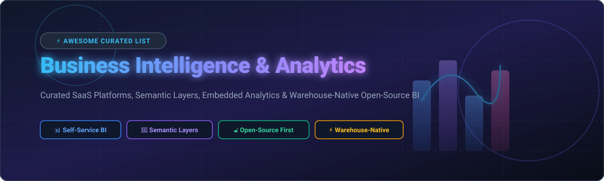

# 📊 Awesome-Business-Intelligence-Analytics

      

> **Awesome-Business-Intelligence-Analytics**  
> *A Curated List of SaaS Products & Open-Source GitHub Projects Focused on Self-Service Dashboards, Semantic Layers, Embedded Analytics & Warehouse-Native BI*  
> **📅 Last updated:** October 2026

Welcome to the definitive, SEO-optimized curated directory of **Business Intelligence (BI) & Data Analytics platforms**. Whether you are an enterprise data architect, BI engineer, analytics leader, or startup developer, this list covers leading commercial SaaS products and open-source data visualization software for building self-service dashboards, governed semantic layers, embedded customer analytics, and warehouse-native reporting.

---

## 📌 Table of Contents
- 📈 [Market Landscape & Size](#-market-landscape--size)
- ☁️ [SaaS & Hosted BI Platforms](#️-saas--hosted-bi-platforms)
- 🔓 [Open-Source GitHub BI Projects](#-open-source-github-bi-projects)
- 🤝 [How to Contribute](#-how-to-contribute)
- 💖 [Support](#-support)
- ⚠️ [Disclaimer](#️-disclaimer)
- 📈 [Star History](#-star-history)

---

## 📈 Market Landscape & Size

The global **Business Intelligence & Analytics market size** is estimated at **$33.2 Billion in 2026** (projected to reach over $54 Billion by 2030 at a ~10.4% CAGR). 

The sector is **moderately fragmented**: mega-cap hyper-scalers (Microsoft Power BI, Salesforce Tableau, Google Looker) capture over 65% of large enterprise workloads, but specialized SaaS providers (ThoughtSpot, Sisense, Domo) and rapidly expanding warehouse-native open-source solutions (Apache Superset, Metabase, Cube, Lightdash) thrive by capturing developer-first embedded analytics, semantic modeling, and cost-effective self-hosted BI pipelines.

---

## ☁️ SaaS & Hosted BI Platforms

Commercial Business Intelligence platforms sorted by company scale (Valuation / Revenue):

| Product | Scale (Valuation / Annual Revenue) 🏢 | Pricing 💰 | Free Tier / Trial Limit 🎁 | Best For 🎯 |
| :--- | :--- | :--- | :--- | :--- |
| **[Microsoft Power BI](https://powerbi.microsoft.com/)** 🔷 | **~$3.1 Trillion** *(Microsoft Corp parent valuation)* | Pro plan starting at **$10/user/month**; Premium Per User at **$20/user/month** | Free Power BI Desktop version (local editing, published reports require Pro); Fabric 60-day free trial | Enterprise BI with deep Microsoft 365, Teams, and Azure ecosystem integration |
| **[Looker (Google Cloud)](https://cloud.google.com/looker)** 🔍 | **~$2.1 Trillion** *(Alphabet parent valuation; acquired Looker for $2.6B)* | Custom enterprise contracts starting at **~$3,000/month** (~$36,000/year base platform fee + user licenses) | 30-day Google Cloud free trial with $300 free credits | Centralized governance with LookML semantic layer modeling on cloud warehouses |
| **[Tableau (Salesforce)](https://www.tableau.com/)** 📊 | **~$280 Billion** *(Salesforce parent valuation; acquired Tableau for $15.7B)* | Viewer **$15/user/month**, Explorer **$42/user/month**, Creator **$75/user/month** (billed annually) | 14-day full feature free trial; Tableau Public offers free unlimited public visualization hosting | High-end, pixel-perfect interactive visualizations and analyst drag-and-drop exploration |
| **[Qlik Sense](https://www.qlik.com/)** 🧩 | **~$10 Billion** *(Estimated Valuation; Thoma Bravo portfolio)* | Standard plan starting at **$825/month** (includes 25 users; additional users $33/user/month) | 30-day free cloud trial (full enterprise capability, up to 5 users) | Associative memory analytics engine enabling free-form multi-table data discovery |
| **[ThoughtSpot](https://www.thoughtspot.com/)** 💡 | **~$4.5 Billion** *(Valuation; $150M+ ARR)* | Essentials plan starting at **$950/month** (includes 5 million query rows/month) | 30-day free trial with unlimited search queries and pre-built sample data | AI-powered natural language search analytics and automated insights for business users |
| **[Sisense](https://www.sisense.com/)** ⚡ | **~$1.1 Billion** *(Valuation; $140M+ ARR)* | Starter tier starting at **$999/month** (includes up to 100K rows and 5 users) | 30-day free trial for Cloud/Self-Hosted deployment | White-label embedded analytics with customizable SDKs and In-Chip analytics engine |
| **[Domo](https://www.domo.com/)** 🚀 | **~$400 Million** *(Public Market Cap; $320M+ ARR)* | Freemium base; paid consumption credits starting at **$300/month** | Free forever plan available (includes 300 credits/month, up to 5 users) | All-in-one business management platform combining low-code ETL, storage, and executive dashboards |
| **[Mode Analytics (ThoughtSpot)](https://mode.com/)** 📈 | **~$200 Million** *(Acquired by ThoughtSpot for $200M in 2023)* | Enterprise custom contracts starting at **~$1,000/month** ($12,000/year base) | 14-day free trial with full SQL, Python, and R collaborative notebook capabilities | Collaborative code-first data science and SQL analytics with integrated interactive reports |
| **[GoodData](https://www.gooddata.com/)** 🛠️ | **~$150 Million** *(Estimated Valuation / Private)* | Enterprise/Embedded tier starting at **$1,500/month** (includes unlimited users) | Free forever community tier (includes 1 workspace, 5 data sources, up to 100MB storage) | Headless BI and React/Angular SDK developer-first embedded analytics |

---

## 🔓 Open-Source GitHub BI Projects

Open-source BI platforms, semantic engines, and reporting frameworks sorted by **GitHub Stars** (descending):

| Project | GitHub Stars 🌟 | License 📄 | Key Features & Architecture ⚡ | Best For 🎯 |
| :--- | :--- | :--- | :--- | :--- |
| **[Grafana](https://github.com/grafana/grafana)** 📈 |  | AGPL-3.0 | Operational dashboards, real-time time-series visualization, Prometheus/SQL plugins, alerting engine | Infrastructure monitoring, APM metrics, IoT, and real-time operational BI |
| **[Apache Superset](https://github.com/apache/superset)** 🔷 |  | Apache-2.0 | 40+ warehouse SQL connectors, stateless cloud-native horizontal scaling, Jinja SQL templating, fine-grained RLS | Enterprise-grade self-service BI and high-concurrency embedded analytics dashboards |
| **[Metabase](https://github.com/metabase/metabase)** 🟢 |  | AGPL-3.0 | 5-minute setup, no-code visual query builder, interactive dashboard filters, automated Slack/email alerts | Startups and non-technical teams needing instant self-service data exploration |
| **[Redash](https://github.com/getredash/redash)** 🔴 |  | BSD-2-Clause | SQL query editor, parameterised queries, automatic visualization generation, REST API access | Data-savvy teams wanting simple, SQL-driven dashboarding and scheduled reporting |
| **[DataEase](https://github.com/dataease/dataease)** 🎨 |  | GPL-3.0 | Open-source Tableau alternative, drag-and-drop report layout, multi-source dataset blending | Organizations seeking a modern, visually rich self-service BI portal |
| **[Cube](https://github.com/cube-js/cube)** 🧊 |  | Apache-2.0 | Universal semantic layer, code-first data modeling, pre-aggregations caching, GraphQL/REST/Postgres SQL API | Building scalable embedded analytics applications and AI context semantic layers |
| **[PyGWalker](https://github.com/Kanaries/pygwalker)** 🐍 |  | Apache-2.0 | Turns pandas/polars DataFrames into Tableau-style interactive UI within Jupyter Notebooks | Data scientists & Python analysts desiring instant visual EDA in notebooks |
| **[Pentaho Data Integration](https://github.com/pentaho/pentaho-kettle)** 🔄 |  | Apache-2.0 | Enterprise ETL (Kettle), visual workflow designer, multi-database integration, legacy reporting engine | Heavy enterprise workflows requiring unified data integration, transformation, and BI |
| **[Evidence](https://github.com/evidence-dev/evidence)** 📄 |  | MIT | Business Intelligence as Code, Markdown + SQL reports, version-controlled analytics via Git | Developers who prefer code-first BI reports rendered as static Markdown websites |
| **[Lightdash](https://github.com/lightdash/lightdash)** ⚡ |  | MIT | Open-source Looker alternative, native dbt YAML semantic integration, automated metric lineage | Data teams operating on dbt who want code-governed BI metrics and dimensions |
| **[Rill](https://github.com/rilldata/rill)** 🚀 |  | Apache-2.0 | BI-as-code (YAML+SQL), sub-second queries powered by DuckDB and ClickHouse, AI agent-ready | Fast operational analytics on fast OLAP engines with developer-centric workflows |
| **[Helical Insight](https://github.com/helicalinsight/helicalinsight)** 🤖 |  | AGPL-3.0 | BYO-LLM conversational AI analytics, pixel-perfect paginated financial reports, 360+ APIs | Enterprise teams needing AI text-to-chart BI alongside traditional canned reporting |
| **[BIRT Engine](https://github.com/eclipse/birt)** ☕ |  | EPL-2.0 | Eclipse-based Java reporting framework, XML report designs, PDF/Excel output generators | Software engineers embedding complex structured reporting into Java enterprise applications |

---

## 🤝 How to Contribute

We welcome contributions from the data community! To add or update an entry:
1. 🍴 **Fork** this repository.
2. ✏️ Edit `README.md` following the table formatting rules.
3. 🔍 Ensure descriptions remain objective, technical, and accurate.
4. 🚀 Submit a **Pull Request** with a brief summary of the changes.

---

## 💖 Support

Thank you for visiting and supporting this project! If you find this curated BI & Analytics guide helpful, please consider:
- 🌟 **Starring** the repository on GitHub
- 🍴 **Forking** it to keep your own reference copy
- 📢 **Sharing** it with colleagues, analytics engineers, and data teams
- ☕ **Buying a Coffee / Sponsoring:** Support future maintenance via the [GitHub Sponsor Dashboard](https://github.com/sponsors/ishandutta2007)!

---

## ⚠️ Disclaimer

This list is community-curated for informational and educational purposes. It does not constitute commercial endorsement. Always evaluate data security, row-level access permissions, SOC2 compliance, and governance requirements prior to deploying BI platforms in production environments.

---

## 📈 Star History

---

✨ *Maintained for data analysts, BI engineers, analytics leaders, and data platform architects.*  
🚀 *Let's build a more open, transparent, and code-driven Business Intelligence ecosystem.*
